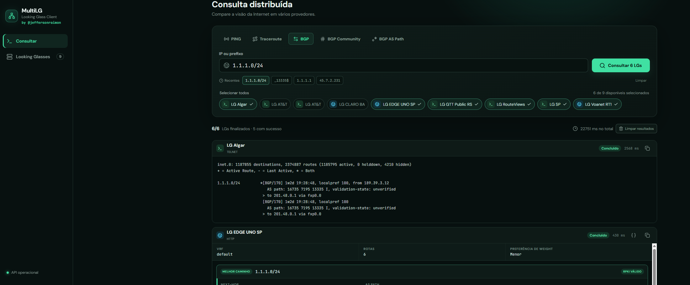
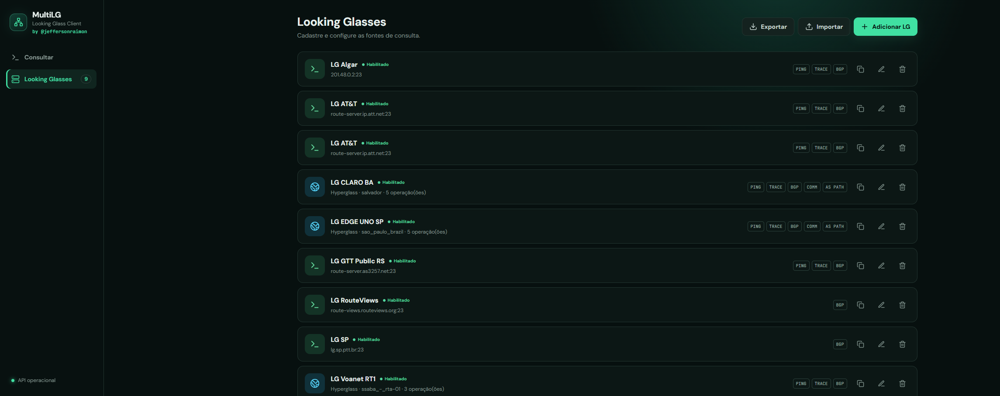

# MultiLG 

Cliente web auto-hospedado para executar uma única consulta em vários Looking Glass e comparar os resultados lado a lado. Suporta fontes HTTP/HTTPS e Telnet, com operações de ping, traceroute, rota BGP, community BGP e expressão regular de AS Path configuráveis por provedor.

<p align="center">
  
</p>


<p align="center">
  
</p>


## Funcionalidades

- Consulta paralela em múltiplos Looking Glass.
- Resultados progressivos: cada LG aparece assim que termina, sem aguardar os demais, e traceroutes Telnet exibem os saltos em tempo real.
- Exibição de até quatro resultados por página, com navegação anterior/próxima.
- Cancelamento imediato da consulta, preservando a saída parcial, e limpeza dos resultados exibidos.
- Filtro automático dos LGs conforme a operação selecionada: BGP, community, AS Path, ping ou traceroute.
- Importação e exportação da lista de LGs em formato JSON diretamente pela interface web.
- Deduplicação inteligente na importação (atualiza LGs existentes por Nome/ID sem gerar duplicatas).
- Pasta `./template/` com modelos JSON de Looking Glasses testados e funcionais.
- Duplicação de LGs existentes para reaproveitar configurações com segurança.
- Histórico local dos oito últimos IPs ou prefixos consultados, com atalhos e opção para limpar.
- Configuração HTTP genérica para requisições GET e POST, respostas em texto ou JSON e extração por regex.
- Integração Hyperglass-like com descoberta de dispositivos e operações diretamente pela API.
- Visualização amigável das rotas BGP estruturadas do Hyperglass, com destaque do melhor caminho, métricas, RPKI e communities.
- Sessões Telnet com autenticação opcional, prompts configuráveis e pré-comandos.
- Comandos Telnet IPv4 e IPv6 separados quando o equipamento exigir sintaxes diferentes.
- Opções para desativar a paginação em equipamentos Cisco/FRR/RouteViews e Juniper/Junos.

## Subir com Docker

```bash
cp .env.example .env
# Edite LG_SECRET_KEY no .env e use uma chave longa e aleatória.
docker compose up -d --build
```

Acesse `http://IP-DO-SERVIDOR:8080`. Os cadastros ficam em `./data/multilg.db`.

> Não altere `LG_SECRET_KEY` depois de cadastrar fontes: ela criptografa as configurações e credenciais no banco.

## Executar uma consulta

1. Escolha BGP, BGP Community, BGP AS Path, ping ou traceroute.
2. Informe um endereço IP; para BGP também é aceito um prefixo CIDR.
3. Selecione os LGs e clique em **Consultar**.

A tela mostra somente os LGs habilitados que oferecem a operação escolhida. Os resultados são apresentados individualmente conforme chegam e divididos em páginas de até quatro cards.

Após uma consulta válida, o destino é salvo no `localStorage` do navegador. O histórico não é enviado nem armazenado no servidor e pode ser removido pelo botão **Limpar**.

## Cadastro HTTP

Cada operação tem sua própria requisição. Use os marcadores `{target}` e `{operation}` na URL, query params, headers ou corpo.

Exemplo de uma API JSON:

- URL: `https://lg.exemplo.net/api/ping`
- Método: `GET`
- Query params: `{ "address": "{target}" }`
- Tipo de resposta: `JSON`
- JSON path: `data.output`

Para uma página HTML, selecione resposta `Texto / HTML` e use uma expressão regular com grupo de captura, por exemplo `<pre[^>]*>([\s\S]*?)</pre>`.

## Cadastro Hyperglass-like

Selecione **HTTP / HTTPS** e marque **Hyperglass-like**. Informe somente a URL raiz do LG, por exemplo `http://lg.voanet.net.br`, e clique em **Detectar API**. O MultiLG consulta:

- `/api/devices/` para listar os dispositivos disponíveis;
- `/api/queries/` para identificar BGP, ping e traceroute;
- os metadados públicos do frontend para obter o `queryType` interno de cada dispositivo;
- `/api/query` para executar a consulta selecionada.

Depois da detecção, escolha o dispositivo (`queryLocation`). Um cadastro representa um dispositivo do Hyperglass; para usar mais de um roteador da mesma instalação, duplique o LG e altere a localização.

O botão **Detectar API** preenche os `queryType` específicos do dispositivo selecionado e os atualiza ao trocar de roteador. Isso cobre instalações com diretivas personalizadas, inclusive quando roteadores da mesma instalação usam plataformas diferentes. Se esses metadados não estiverem publicados, os padrões Juniper abaixo são usados como base:

- Ping: `__hyperglass_juniper_ping__`
- Traceroute: `__hyperglass_juniper_traceroute__`
- BGP estruturado: `__hyperglass_juniper_bgp_route_table__`

Esses identificadores continuam editáveis separadamente. Durante uma consulta, se a API rejeitar um identificador salvo como inexistente, o MultiLG tenta detectá-lo novamente e repete a operação automaticamente. Operações desmarcadas deixam de aparecer para esse LG na tela de consulta.

O MultiLG detecta tanto o Hyperglass 2.x (`camelCase`, endpoint `/api/query`) quanto o formato legado 1.x (`snake_case`, endpoint `/api/query/` e VRF). Também importa o timeout publicado pelo servidor, limitado a 300 segundos, o que é útil para pesquisas de community e AS Path em tabelas grandes.

Instalações que protegem `/api` com um cookie de sessão também são detectadas. O conector abre a página inicial para receber o cookie HTTP-only e então executa o POST usando a mesma sessão, sem exigir configuração manual.

Quando disponíveis no dispositivo, duas operações avançadas aparecem automaticamente:

- **BGP Community**: aceita valores como `7195:55000` ou `large:7195:55:0`;
- **BGP AS Path**: aceita expressões como `_13335$`, `^65000_` ou `_65000_65001_`.

As operações são detectadas por roteador. Assim, uma instalação pode oferecer as cinco consultas em alguns locais e somente BGP, ping e traceroute em outros, sem exibir opções incompatíveis.

Se o Hyperglass responder como sucesso, mas a saída do roteador contiver erros de CLI conhecidos, como `% Invalid input detected`, o MultiLG marca o resultado como erro e mostra a mensagem do equipamento.

O corpo enviado à API segue o formato nativo do Hyperglass:

```json
{
  "queryLocation": "ssaba_-_rta-01",
  "queryType": "__hyperglass_juniper_bgp_route_table__",
  "queryTarget": ["8.8.4.4"]
}
```

Quando `output` contém rotas BGP estruturadas, o resultado é apresentado como painéis de rotas, com o melhor caminho destacado. O botão `{}` alterna para o JSON original e o botão de cópia preserva a resposta completa. Mensagens de erro retornadas pela API também são exibidas no próprio resultado.

## Cadastro Telnet

Informe host, porta, prompts e os comandos aceitos pelo servidor. Exemplos:

- Ping: `ping {target} count 5`
- Traceroute: `traceroute {target}`
- BGP: `show bgp route {target}`

Ao habilitar uma operação, informe seu comando IPv4/padrão. Use o botão **Usar comando IPv6 diferente** quando a sintaxe para IPv6 não for igual. Sem essa opção, alvos IPv6 reutilizam automaticamente o comando padrão.

Exemplo com comandos separados:

- IPv4: `show bgp ipv4 unicast {target} longer-prefixes`
- IPv6: `show bgp ipv6 unicast {target} longer-prefixes`

Os prompts são expressões regulares. O padrão final `[>#]\s*$` atende CLIs comuns, mas deve ser ajustado ao LG real.

Em **Desativar paginação**, escolha o perfil compatível com a CLI:

- Cisco, FRR e RouteViews: `terminal length 0` para saídas que param em `--More--`.
- Juniper e Junos: `set cli screen-length 0` para saídas que param em `---(more)---`.

Para outras CLIs, use o campo **Outros pré-comandos**, um comando por linha.

Se o host abrir diretamente no prompt final mesmo com credenciais cadastradas, o conector detecta esse prompt e continua sem tentar autenticar. Mensagens de timeout indicam a etapa que não terminou, como conexão, autenticação, pré-comando ou comando principal.

Durante traceroutes Telnet, cada trecho recebido é enviado progressivamente à interface. O timeout do prompt é contado por inatividade: enquanto o LG continuar produzindo saída, o comando pode ultrapassar o valor configurado; ele só expira após esse período sem receber novos dados.

## Importação, Exportação e Templates Prontos

O MultiLG permite exportar e importar a lista de Looking Glasses cadastrados em arquivo JSON.

### Importação e Exportação
- **Exportar**: Baixa o arquivo `multilg-looking-glasses.json` contendo todas as fontes registradas.
- **Importar**: Permite carregar um arquivo JSON contendo um ou vários LGs em lote.
- **Deduplicação Inteligente**: Se o LG importado coincidir por Nome ou ID com um registro existente no banco, o MultiLG atualiza as configurações em vez de criar cadastros duplicados.

### Templates Prontos (`./template`)
Na pasta [`./template`](./template), estão disponíveis os modelos JSON prontos e validados para importação direta.

A listagem de Looking Glasses utilizada na criação dos templates foi obtida no [Brasil Peering Forum](https://wiki.brasilpeeringforum.org/w/Looking_Glass)

## Limitações importantes

- Looking Glass com CAPTCHA, JavaScript obrigatório, CSRF dinâmico ou autenticação em múltiplas etapas precisa de um adaptador específico; o conector HTTP genérico não contorna essas proteções.
- Telnet transmite dados sem criptografia. Prefira fontes públicas sem senha ou use a aplicação em uma rede de gerenciamento confiável.
- Esta versão não possui login próprio. Restrinja a porta 8080 por firewall, VPN ou reverse proxy com autenticação.
- Cadastre apenas serviços que você tem autorização para consultar e respeite limites de uso dos provedores.

## API

A documentação interativa está disponível em `http://IP-DO-SERVIDOR:8080/docs`.

Endpoints principais:

- `GET /api/looking-glasses`
- `GET /api/looking-glasses/export`
- `POST /api/looking-glasses/import`
- `POST /api/looking-glasses`
- `PUT /api/looking-glasses/{id}`
- `POST /api/looking-glasses/{id}/duplicate`
- `DELETE /api/looking-glasses/{id}`
- `POST /api/hyperglass/discover`
- `POST /api/query`
- `POST /api/query/stream`

`POST /api/query` retorna o lote completo. `POST /api/query/stream` usa NDJSON e envia eventos progressivos dos tipos `start`, `partial`, `result` e `complete`; é o endpoint utilizado pela interface web.

## Desenvolvimento local

Backend:

```bash
cd backend
export LG_SECRET_KEY='uma-chave-local-com-mais-de-16-caracteres'
export LG_DATABASE_PATH='./multilg.db'
pip install -r requirements.txt
uvicorn app.main:app --reload --port 8080
```

Frontend:

```bash
cd frontend
npm install
npm run dev
```

O frontend abre em `http://localhost:5173` e já encaminha `/api` para o backend na porta 8080.

## Contribuição

Uso da API do Hyperglass, por [@jorgewallace](https://github.com/jorgewallace).

## Licença

Este projeto está licenciado sob a Licença MIT - consulte o arquivo [LICENSE](./LICENSE) para obter mais detalhes.
by [@jeffersonraimon](https://github.com/jeffersonraimon).

